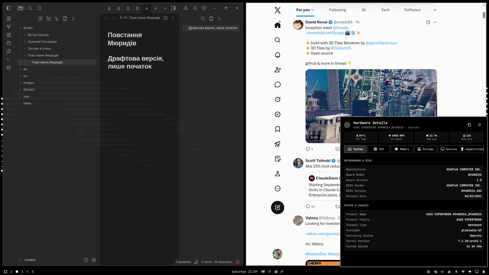

# Omarchy Hardware Details Plugin (`gladimdim.hardware.info`)

An elegant, native hardware monitor and system inspection plugin for the [Omarchy](https://github.com/omarchy/omarchy) status bar.



## ✨ Features

- **Bar Tray Icon (``)**: Sits right in your dock/tray with tooltip indicators and click actions.
- **Hero Overview**: Live CPU package temperature (with thermal thresholds), cooling fan RPM, memory usage percentage, and primary filesystem capacity.
- **Instant JSON Export**: Copy complete structured hardware reports directly to clipboard (`wl-copy`) with a single click or keyboard shortcut.
- **Ultra-Fast & Lightweight**: Probes dynamic metrics (load average, per-core clocks, memory, thermal sensors) in <3ms using direct sysfs / proc inspection, caching static DMI data.
- **Full Keyboard Navigation**: Switch tabs with `1`–`6` or `←` / `→` arrow keys, refresh with `r`, copy with `c`, and dismiss with `Esc`.

---

## 🗂️ 6 Categorized Hardware Views

### 1. 󰌢 System & Motherboard
- **Motherboard & BIOS**: Manufacturer, board model, board revision, BIOS vendor, BIOS version, and release date.
- **Chassis & OS**: Product name, product family, chassis classification (Desktop, Notebook, etc.), hostname, distribution name, kernel release, and system uptime.

### 2.  Processor / CPU
- **CPU Specifications**: Processor model, vendor ID, architecture (`x86_64`), core/thread topology, sockets, base frequency, boost frequency, active scaling governor, and scaling driver.
- **Cache Hierarchy**: Per-core and shared cache sizes (L1 Data, L1 Instruction, L2 Cache, L3 Shared Cache).
- **Live Per-Core Frequencies**: Real-time clock speed meters (MHz) for every individual logical core.

### 3. 󰘚 Memory / RAM
- **System RAM Breakdown**: Total, used, available, free, cached, and buffer memory with formatted visual meters.
- **Swap / ZRAM**: Total capacity, active usage, and free swap allocation.
- **Memory Module Topology**: Physical RAM channel breakdown (slot IDs, memory technology like LPDDR4/DDR5, capacity per stick, and configured MT/s transfer speeds).

### 4. 󰋊 Storage & NVMe SSD
- **Physical Drives**: Model name, interface/transport (`NVME`, `SATA`, `RAM`), serial numbers, and NVMe composite temperature sensors.
- **Filesystem Mounts**: Partition tree table (`/`, `/home`, `/boot`, etc.) showing filesystem type (`btrfs`, `vfat`, `ext4`), total size, used space, free space, and capacity meters.

### 5. 󰍹 Peripherals & Devices
- **Graphics / GPU**: Discrete and integrated GPU controllers (e.g. Intel Iris Xe Graphics, NVIDIA, AMD Radeon).
- **Network Interfaces**: High-speed Wi-Fi adapters (Wi-Fi 6/6E/7) and Ethernet network controllers.
- **Audio Subsystems**: High Definition Audio codecs and DSP controllers.

### 6. 󰞌 Capabilities & Security
- **Vector & SIMD Extensions**: AVX-512 (Foundation, BW, DQ, VL, VNNI for AI/DL, VBMI), AVX2, AVX, FMA3, SSE4.2, SSE4.1, MMX badges.
- **Hardware Cryptography**: AES-NI, Vector AES (VAES), SHA-NI, Galois Field (GFNI), RDRAND, RDSEED, PCLMULQDQ.
- **Virtualization & Privilege**: Intel VT-x / AMD-V, EPT, VPID, Nested Virtualization (VNMI), SMEP, SMAP, CET Shadow Stack.
- **Hardware Vulnerability Mitigations**: Real-time kernel mitigation status for Spectre v1, Spectre v2, Meltdown, Retbleed, MDS, L1TF, GDS, Speculative Store Bypass, etc.

---

## 🚀 Installation

### Option 1: Via Omarchy Plugin Manager (Recommended)

```bash
omarchy plugin add https://github.com/gladimdim/omarchy-hardware-info-plugin --enable
```

To place it specifically next to your system tray in `~/.config/omarchy/shell.json`:
```bash
omarchy plugin enable gladimdim.hardware.info --after gladimdim.tray
```

### Option 2: Manual Clone

```bash
git clone https://github.com/gladimdim/omarchy-hardware-info-plugin ~/.config/omarchy/plugins/gladimdim.hardware.info
omarchy plugin enable gladimdim.hardware.info
omarchy restart shell
```

---

## ⌨️ Controls & Shortcuts

| Action | Control |
| :--- | :--- |
| **Toggle Panel** | Left-click bar icon or `omarchy-shell gladimdim.hardware.info toggle` |
| **Refresh Stats** | Right-click bar icon or press `r` |
| **Switch Tabs** | Number keys `1`–`6` or `←` / `→` arrow keys |
| **Copy Hardware JSON** | Press `c` or click the clipboard button |
| **Close Panel** | Press `Esc` or click outside |

---

## 📦 System Dependencies

Standard packages included on most Omarchy / Arch installations:
- `python3` (data collector)
- `inxi` (RAM module & channel detection)
- `lm_sensors` (thermal and fan probe)
- `util-linux` (`lscpu`, `lsblk`)
- `pciutils` (`lspci`)
- `wl-clipboard` (clipboard JSON export)

---

## 📄 License

MIT License © 2026 Dmytro Gladkyi
